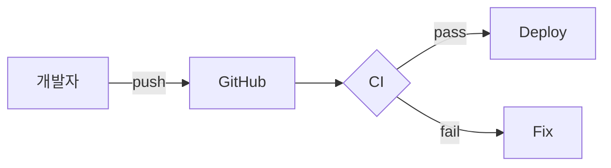

# Markdown(".md") 사용법

> 이 문서는 **Markdown 문법과 GitHub 확장(GFM)** 을 한번에 정리했습니다.  
예시는 전부 실행 가능한 형태로 넣었습니다.
 
---

## 목차
- [1. 기본 개념](#1-기본-개념)
- [2. 제목ㆍ단락ㆍ줄바꿈](#2-제목ㆍ단락ㆍ줄바꿈)
- [3. 강조ㆍ인라인 코드ㆍ인용](#3-강조ㆍ인라인-코드ㆍ인용)
- [4. 목록(순서/글머리/체크리스트)](#4-목록순서글머리체크리스트)
- [5. 코드 블록(언어 하이라이트ㆍdiff)](#5-코드-블록-언어-하이라이트ㆍdiff)
- [6. 링크ㆍ이미지ㆍ앵커](#6-링크ㆍ이미지ㆍ앵커)
- [7. 표(Table)](#7-표table)
- [8. 수식(MathJax)](#8-수식mathjax)
- [9. 주석ㆍ각주(footnotes)](#9-주석ㆍ각주footnotes)
- [10. 콜아웃(Callouts)ㆍ인용문](#10-콜아웃calloutsㆍ인용문)
- [11. 접기/펼치기(details/summary)](#11-접기펼치기detailssummary)
- [12. Mermaid 다이어그램](#12-mermaid-다이어그램)
- [13. 이모지ㆍ자동 링크(GitHub 전용)](#13-이모지ㆍ자동-링크github-전용)
- [14. HTML 병용과 이스케이프](#14-html-병용과-이스케이프)
- [15. 자주 쓰는 패턴 스니펫](#15-자주-쓰는-패턴-스니펫)
- [16. 체크리스트(출고 전 점검)](#16-체크리스트출고-전-점검)
- [부록 A. 앵커 규칙(헤딩 링크)](#부록-a-앵커-규칙헤딩-링크)
- [부록 B. 배치(Badges) 예시](#부록-b-배지badges-예시)

---

## 1. 기본 개념
- **Markdown**: 가벼운 문서 모팻. `.md` 확장자.
- **GFM(GitHub Flavored Markdown)**: GitHub가 확장한 마크다운 (테이블, 체크박스, 자동링크, Mermaid, 수식 등 지원).
- **목표**: "문서 가독성⬆️, 유지보수⬆️, 복붙 난이도⬇️".

---

## 2. 제목ㆍ단락ㆍ줄바꿈

# H1 제목 (문서당 1개 권장)
## H2 부제
### H3 섹션
#### H4 소섹션

문단은 빈 줄로 구분합니다.

줄바꿈은<br> 강제 줄바꿈은 `<br>` 을 쓰거나  
문장 끝에 공백 2칸을 넣습니다.

- H1은 문제 제목에만 사용 권장. (README 최상단 등)

---

## 3. 강조ㆍ인라인 코드ㆍ인용

**굻게**, *기울임*, ~~취소선~~, **굻게 와 *혼합***  
`인라인 코드` 로 짧은 명령/식별자 표시

> 인용문은 이렇게. 여러 줄도 가능.
>> 중첩 인용

---

## 4. 목록(순서/글머리/체크리스트)

1. 순서형 항목
2. 숫자는 자동 증가

- 글머리 기호
    - 하위 단계
        - 더 하위

- [ ] 작업 미완료 (Task List)
- [x] 작업 완료

> 체크 리스트는 이슈ㆍPR 본문에서 **클릭으로 체크** 가능(GitHub).
 
---

## 5. 코드 블록 (언어 하이라이트ㆍdiff)
```bash
# 터미널 예시
git init
git status
```
```python
def add(a, b):
    return a + b
```
```diff
- password: "1234"
+ password: "${SECRET}"
```
> 언어 식별자 (bash, sh, zsh, python, json, yaml, sql, diff 등)를 붙이면 **문법 하이라이트**가 적용됩니다.

---

## 6. 링크ㆍ이미지ㆍ앵커

[링크 텍스트](https://example.com)  
[같은 저장소의 상대 경로 링크](./docs/CONTRIBUTING.md)  
[같은 문서 내 섹션으로 이동](#6-링크이미지앵커)  
참조식 링크도 가능: [공식문서][docs]

이미지:


이미지에 링크 걸기:
[](./CI.md)

[docs]: https://git-scm.com/doc

> **앵커(헤딩 링크)** 규칙은 [부록 A](#부록-b-배지badges-예시) 참고.

---

## 7. 표(Table)

| 열A            | 열B | 열C |
|:--------------|:---|---:|
| 좌             | 가운데| 우 |
| 긴 문장은<br>줄바꿈으로|

- 정렬: 왼쪽`:--`, 가운데`:---:`, 오른쪽`---:`
- 줄바꿈은 `<br>`권장. 파이프(`|`)는 필요 시 `\|`로 이스케이프.

---

## 8. 수식(MathJax)

인라인 수식: $E = mc^2$

블록 수식:
$$
\int_a^b f(x)\,dx = F(b) - F(a)
$$

> GitHub는 LaTeX 스타일 수식 렌더링을 지원합니다.

---

## 9. 주석ㆍ각주(footnotes)

각주 예시 문장[^1] 입니다.  

[^1]: 여기 각주 내용을 작성합니다. 여러 줄도 가능.

---

## 10. 콜아웃(Callouts)ㆍ인용문

> [!NOTE]  
> 참고: 설치 전에 Node.js 18+ 버전을 권장합니다.

> [!TIP]  
> 팁: `npx` 를 활용하면 전역 설치 없이 실행 가능.

> [!WARNING]  
> 경고: `git reset --hard` 는 워킹 디렉터리 변경을 **파괴**합니다.```

> GitHub 문서 스타일의 **Callouts**. `[!NOTE]`, `[!TIP]`, `[!IMPORTANT]`, `[!WARNING]`, `[!CAUTION]` 사용.

---
## 11. 접기/펼치기(details/summary)

<details>
    <summary>설치 로그 보기</summary>

    ```bash
    npm i
    npm run build
    ```

</details>

>  긴 로그/보조 정보를 접어 둘 때 유용.

---

## 12. Mermaid 다이어그램

> GitHub는 ` ```mermaid ` 블록을 **바로 렌더링**합니다 (네트워크 다이어그램, 시퀀스, 간트 등).

---

## 13. 이모지ㆍ자동 링크(GitHub 전용)

이모지: :tada: :rocket: :memo:

이슈/PR 지동 링크: #123, org/repo#456
커밋 SHA 자동 링크: 1a2b3c4
유저 멘션: @username

> 가독성과 협업 맥락을 높여줍니다.

---

## 14. HTML 병용과 이스케이프
- 표 정렬/레이아웃, 이미지 크기 제어 등은 **HTML 태그**로 보완 가능
```md
<p align="center">
    
</p>
```
- **이스케이프**: 마크다운 문법 문자 그대로 쓰기
```md
\*별포\*는 강조가 아니라 문자 그대로
\[링크 텍스트\]\(URL\)
```
- 이스케이프가 필요한 주요 문자: `\` `*` `_` `{` `}` `[` `]` `(` `)` `#` `+` `-` `.` `!` `|` `<` `>` `&`

---

## 15. 자주 쓰는 패턴 스니펫

### 15.1 README 헤더 템플릿

# 프로젝트명

[](./.github/workflows/ci.yml)
[](./LICENSE)

> 한 줄 소개: 무엇을 해결하는가?

## 특징
- 포인트 1
- 포인트 2

## 빠른 시작
```bash
git clone https://github.com/{{owner}}/{{repo}}.git
cd {{repo}}
make run
```

### 문서
- [설치](./docs/INSTALL.md)
- [기여 가이드](./CONTRIBUTING.md)

### 15.2 Git 커밋 메시지 규칙(예: Conventional Commits)
```md
<type>(scope): <subject>

body(옵션)
BREAKING CHANGE(옵션)

type 예: feat, fix, docs, style, refactor, test, chore, build, ci
예) feat(auth): add OAuth login
```

### 15.3 PR 템플릿(.github/pull_request_template.md)
```md
## 변경 내용
-

## 테스트
-

## 체크리스트
- [ ] 문서/주석 업데이트
- [ ] breaking change 여부 확인
```

### 15.4 라이선스 블록
```md
## License
MIT © {{Your Name}}
```
---

## 16. 체크리스트(출고 전 점검)

- [ ] H1은 문서 제목에만 사용했는가?
- [ ] 목차(TOC) 링크가 정상 동작하는가?
- [ ] 코드 블록에 언어 식별자를 지정했는가?
- [ ] 외부/상대 링크가 끊기지 않는가?
- [ ] 표 파이프(|) 이스케이프 누락은 없는가?
- [ ] 이미지 대체텍스트(alt)가 있는가?
- [ ] 긴 로그/부록은 details로 접었는가?
- [ ] 수식/다이어그램은 올바르게 렌더링되는가?
- [ ] GitHub 전용 기능(이슈/PR 링크, 체크박스)을 적절히 사용했는가?

---

## 부록 A. 앵커 규칙(헤딩 링크)
- GitHub는 헤딩을 **소문자 변환 + 공백 -> 하이폰(-) + 일부 기호 제거**로 앵커를 만듭니다.
    예) `## 링크-이미지.앵커` -> `#링크이미지앵커`가 아니라 `#6-링크이미지앵커`처럼 섹션 번호가 있으면 번호 포함
- 한글/특수문자도 지원. 충돌 시 `-1`, `-2`등을 붙습니다.
- 확실히 하려면 헤딩 앞에 **절 번호**를 붙여 고정 앵커를 확보하세요.

---

## 부록 B. 배지(Badges) 예시
```md
[](./.github/workflows/ci.yml)
[](./docs/tests.md)
[](./LICENSE)
[](#)
```

## 끝으로
- 문서는 **코드와 동일한 품질 기준**으로 다룹니다: 변경 시 PR -> 리뷰 -> 머지.
- 동일 문서에 반복되는 패턴은 **스니펫화**하여 재사용하세요.
- 이 파일 자체를 `DOCS_GUIDE.md`로 저장해두고, 새 repo마다 복사해 시작하면 세팅 시간이 크게 줄어듭니다.